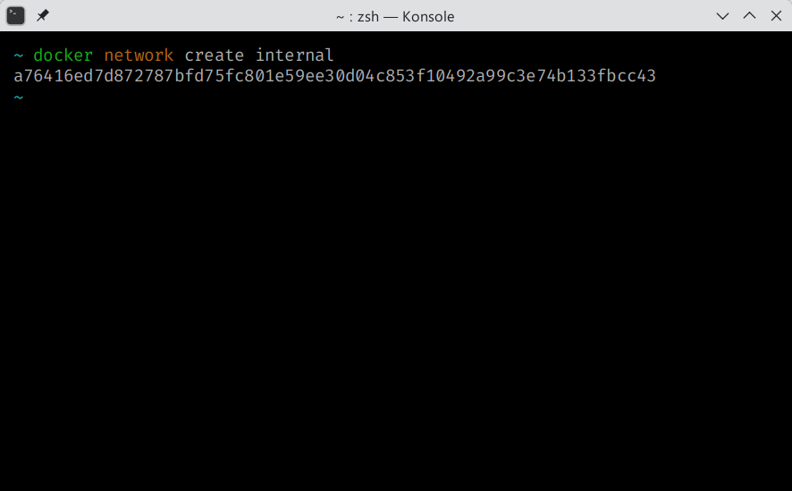
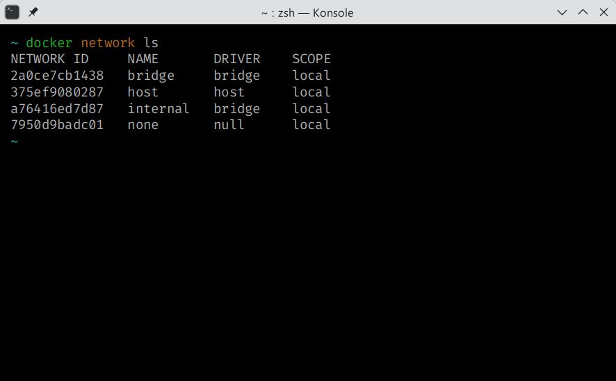
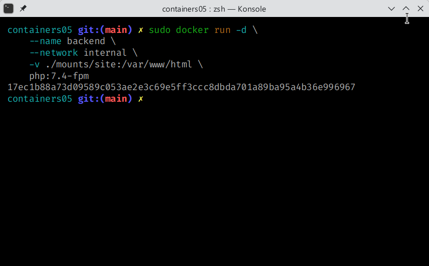
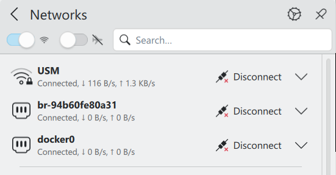
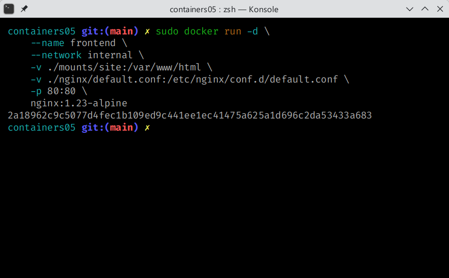
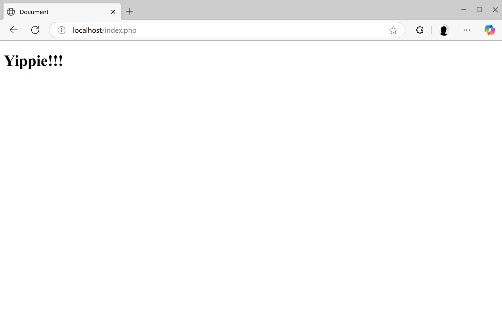

# Containers05

> Realizat de studentul Babacaev Renat, I2301 @renatbabacaev
> \
> Verificat de Mihail Croitor @mcroitor
>
> 10 Aprilie 2025

## Scopul lucrării

Scopul lucrării este crearea a două containere într-o rețea și accesarea site-ului în browser.

## Sarcina

Creăm o aplicație PHP pe baza a două containere: nginx, php-fpm.

## Efectuarea Lucrării

Creăm un [.gitignore](./.gitignore) pentru a nu include site-ul în git:

```conf
# Do not version my site in git
mounts/site/*
```

Creăm fișier [nginx/default.conf](./nginx/default.conf) cu următorul conținut:

```conf
server {
    listen 80;
    server_name _;
    root /var/www/html;
    index index.php;
    location / {
        try_files $uri $uri/ /index.php?$args;
    }
    location ~ \.php$ {
        fastcgi_pass backend:9000;
        fastcgi_index index.php;
        fastcgi_param SCRIPT_FILENAME $document_root$fastcgi_script_name;
        include fastcgi_params;
    }
}
```

Creăm rețeaua pentru docker:

```bash
# Terminalul Vostru

docker network create internal
```



Verificăm existența ei:

```bash
# Terminalul Vostru

docker network ls
```



În această lucrare nu avem nevoie de un `Dockerfile` deoarece noi creăm două containere ci nu una. Le vom crea prin două comenzi.

```bash
# Terminalul Vostru

# Backend

docker run -d \
    --name backend \
    --network internal \
    -v ./mounts/site:/var/www/html \
    php:7.4-fpm
```

> [!IMPORTANT]
> Dacă vă apare eroarea `Permission denied`, culați comenzile într-un mediu elevat de administrator, de exemplu prin `Run as Admin` sau `sudo`



Poate să apară rețeaua în lista de conexiuni



Creăm celălalt container `frontend`

```bash
# Terminalul Vostru

# Frontend

docker run -d \
    --name frontend \
    --network internal \
    -v ./mounts/site:/var/www/html \
    -v ./nginx/default.conf:/etc/nginx/conf.d/default.conf \
    -p 80:80 \
    nginx:1.23-alpine
```



Verificăm disponibilitatea site-ului care l-am plasat în [mounts/site](./mounts/site/)

Accesăm [http://localhost:80](http://localhost:80)



## Întrebări

1. Cum două containere pot interacționa unul cu celălalt

Containerele pot interațciona între ele printr-o conexiune locală sau folder comun.

2. Cum văd containerele unul pe celălalt în cadrul rețelei internal?

Dockerul ține cont de denumirile containerelor în rețeaua în care sunt rulate. Ei pot accesa unul pe altul prin numele container-ului.

3. De ce a fost necesar să se suprascrie configurarea nginx?

Asta era necesar pentru ca php și nginx să aibă acces comun la pagina web. Nginx oferă paginile statice, precum html, css și javascript, iar php proceseasă paginile dinamice.

## Concluzie

În această lucrare de laborator am rulat două containere, unul pentru website, altul pentru pagini web, le-am legat prin-tro rețea docker și am afișat o pagină în browser.
